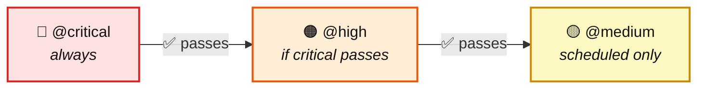

# ElevateOS — Registration Form Tests

End-to-end tests for the ElevateOS registration form, built with Playwright.

## What We Test

Tests are split by priority using tags:

| Tag | Coverage | File |
|-----|----------|------|
| `@critical` | Successful registration, required field validation | `critical-happy-path.spec.ts`, `field-validation.spec.ts` |
| `@high` | Email format, password mismatch, minimum length | `field-validation.spec.ts` |
| `@medium` | Avatar upload — file size and type rejection | `avatar-upload.spec.ts` |

## Getting Started

### 1. Clone the repository

```bash
git clone https://github.com/valenkuzenko/ElevateOS-TestTask.git
cd ElevateOS-TestTask
```

### 2. Install and run

```bash
npm install
npx playwright install --with-deps chromium
npm test
```

Or with Docker (no local browser install needed):

```bash
docker build -t elevateos-tests .
docker run elevateos-tests
```

See [RUNNING.md](RUNNING.md) for all run modes (headed, UI, by tag, single file, reports).

## Project Structure

```
QA_TASK/
├── fixtures/
│   ├── base.fixture.ts          # Shared fixture — provides registrationPage to every test
│   ├── user.fixture.ts          # Generates random user data using Faker
│   └── images/                  # Test avatar files (valid, oversized, wrong type)
├── helpers/
│   ├── avatar-type.enum.ts      # Avatar type constants (Valid, InvalidSize, InvalidType)
│   └── error-messages.enum.ts   # Expected error message strings
├── page-objects/
│   ├── registration.page.ts     # Page Object for the registration form
│   └── success.page.ts          # Page Object for the success confirmation page
└── tests/
    ├── critical-happy-path.spec.ts  # @critical — happy-path registration flow
    ├── field-validation.spec.ts     # @critical, @high — required fields and input validation
    └── avatar-upload.spec.ts        # @medium — file upload edge cases
```

## Test Pipeline

The GitHub Actions pipeline runs tests sequentially — each level waits for the previous one to pass:



| Level | NPM | Grep | Trigger | Condition |
|-------|-----|------|---------|-----------|
| `@critical` | `npm run test:critical` | `npx playwright test --grep @critical` | every push / PR | always runs |
| `@high` | `npm run test:high` | `npx playwright test --grep @high` | every push / PR | after `@critical` passes |
| `@medium` | `npm run test:medium` | `npx playwright test --grep @medium` | weekdays at 06:00 UTC | after `@high` passes |

If `@critical` fails, everything else is skipped — fast feedback, no wasted CI minutes.

To trigger manually: **Actions → Playwright Tests → Run workflow** — pick a specific tag or `all`.

Reports are uploaded as artifacts and retained for 14 days.

## Environment Configuration

| Variable | Description | Default |
|----------|-------------|---------|
| `ENV` | Base URL of the application under test | `https://qa-task.redvike.rocks/` |

To run against a different environment locally, create a `.env` file in the project root (see `.env.example`):

```
ENV=https://staging.example.com/
```

This file is only used for local runs — CI uses its own environment variables.
